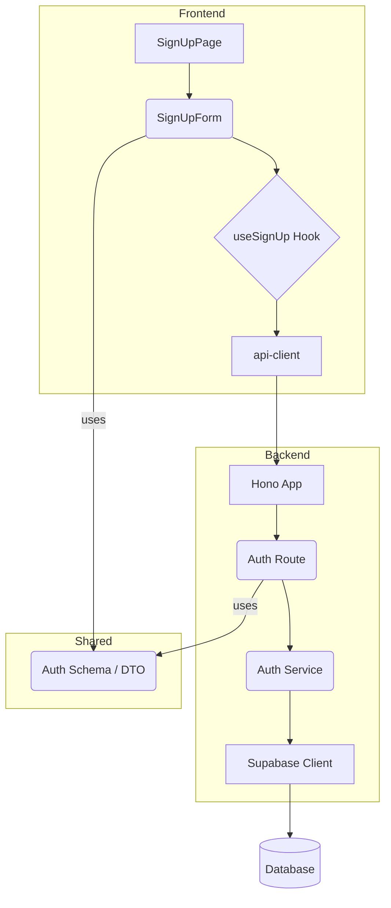

# Usecase 001: Onboarding - Implementation Plan

이 문서는 Usecase 001(신규 사용자 온보딩) 기능 구현을 위한 모듈화 설계안입니다.

---

## 1. 개요

| Module | Location | Description |
| --- | --- | --- |
| **BE: Schema** | `src/features/auth/backend/schema.ts` | Zod를 사용하여 회원가입 요청/응답 데이터 스키마를 정의합니다. | 
| **BE: Service** | `src/features/auth/backend/service.ts` | Supabase 클라이언트를 사용하여 DB와 상호작용하는 비즈니스 로직을 처리합니다. | 
| **BE: Route** | `src/features/auth/backend/route.ts` | `/api/auth/signup` 엔드포인트를 정의하고, Service와 Schema를 연결합니다. | 
| **Shared: DTO** | `src/features/auth/lib/dto.ts` | BE 스키마를 FE에서 재사용할 수 있도록 re-export 합니다. | 
| **FE: Component** | `src/features/auth/components/SignUpForm.tsx` | `react-hook-form`과 `shadcn-ui`를 사용한 회원가입 폼 UI 컴포넌트입니다. | 
| **FE: Hook** | `src/features/auth/hooks/useSignUp.ts` | `react-query`의 `useMutation`을 사용하여 회원가입 API를 호출하는 커스텀 훅입니다. | 
| **FE: Page** | `src/app/signup/page.tsx` | 회원가입 페이지로, `SignUpForm` 컴포넌트를 렌더링합니다. | 

## 2. Module Relationship Diagram



## 3. Implementation Plan

### 3.1. Backend

#### `src/features/auth/backend/schema.ts`
- `SignUpBodySchema`를 `zod.object`로 정의합니다.
  - `email`: `z.string().email()`
  - `password`: `z.string().min(8)` (최소 8자)
  - `name`: `z.string().min(1)`
  - `role`: `z.enum(['learner', 'instructor'])`
  - `termsAgreement`: `z.literal(true)` (반드시 동의해야 함)

#### `src/features/auth/backend/service.ts`
- `signUpService(c, body)` 함수를 구현합니다.
- Supabase Admin 클라이언트(`c.get('supabase')`)를 사용합니다.
- **Unit Test Cases (Conceptual)**:
  ```typescript
  describe('signUpService', () => {
    it('성공적인 요청 시 인증 유저와 프로필, 약관 동의 기록을 생성해야 한다');
    it('이미 존재하는 이메일로 요청 시 에러를 던져야 한다 (EmailConflictError)');
    it('DB 프로필 생성 실패 시 에러를 던져야 한다 (ProfileCreationError)');
  });
  ```

#### `src/features/auth/backend/route.ts`
- `Hono` 인스턴스를 생성하고 `POST /signup` 라우트를 정의합니다.
- `zodValidator` 미들웨어를 사용하여 `SignUpBodySchema`로 요청 body를 검증합니다.
- `signUpService`를 호출하고, 성공/실패 결과에 따라 `success()` 또는 `failure()` 응답을 반환합니다.

### 3.2. Frontend

#### `src/features/auth/hooks/useSignUp.ts`
- `useMutation`을 사용하여 회원가입 뮤테이션을 생성합니다.
- `mutationFn`: `api-client.auth.signup.$post({ json: body })`을 호출합니다.
- `onSuccess`: `useRouter`를 사용해 역할에 따라 적절한 페이지로 리다이렉트합니다.
- `onError`: `useToast`를 사용해 사용자에게 에러 메시지를 표시합니다.

#### `src/features/auth/components/SignUpForm.tsx`
- `"use client"` 지시어를 사용합니다.
- `useForm` (`react-hook-form`)과 `zodResolver`를 사용해 폼 상태와 유효성 검사를 관리합니다.
- `shadcn-ui`의 `Input`, `Button`, `RadioGroup`, `Checkbox`, `Form` 관련 컴포넌트를 사용해 UI를 구성합니다.
- `onSubmit` 핸들러에서 `useSignUp` 훅의 `mutate` 함수를 호출합니다.
- **QA Sheet**:
  - [ ] 이메일, 비밀번호, 이름, 역할, 약관 동의 필드가 모두 렌더링되는가?
  - [ ] 이메일 형식이 올바르지 않을 때 에러 메시지가 표시되는가?
  - [ ] 필수 필드를 채우지 않으면 '가입하기' 버튼이 비활성화되는가?
  - [ ] 제출 시 '가입하기' 버튼에 로딩 상태가 표시되는가?
  - [ ] API 실패 시 Toast 에러 메시지가 표시되는가?
  - [ ] 성공 시 역할에 맞는 페이지로 이동하는가? (learner -> /, instructor -> /instructor/dashboard)

#### `src/app/signup/page.tsx`
- `SignUpForm` 컴포넌트를 import하여 렌더링하는 간단한 페이지 컴포넌트를 작성합니다.
