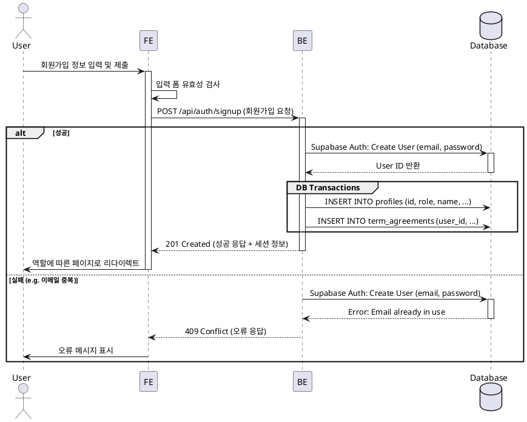

# Usecase 001: 신규 사용자 온보딩

- **Id**: 001
- **Usecase Name**: 신규 사용자 온보딩 (New User Onboarding)
- **Description**: 새로운 사용자가 이메일, 비밀번호, 프로필 정보, 역할을 입력하여 회원가입을 완료하고, 역할에 맞는 첫 페이지로 안내받는다.

---

## 1. Primary Actor

- 가입을 시도하는 비회원 사용자 (Unauthenticated User)

## 2. Precondition

- 사용자가 회원가입 페이지에 접근한 상태이다.

## 3. Trigger

- 사용자가 이메일, 비밀번호, 이름, 역할, 약관 동의 등 필수 정보를 모두 입력하고 '가입하기' 버튼을 클릭한다.

## 4. Main Scenario (Success Flow)

1.  사용자가 회원가입 양식을 채우고 '가입하기' 버튼을 클릭한다.
2.  **[FE]** 입력된 정보(이메일 형식, 비밀번호 복잡도 등)에 대한 클라이언트 사이드 유효성 검사를 수행한다.
3.  **[FE]** 유효성 검사를 통과하면, 가입 정보를 담아 백엔드(BE)에 API 요청을 보낸다. (e.g., `POST /api/auth/signup`)
4.  **[BE]** 요청을 수신하여 서버 사이드 유효성 검사를 수행한다.
5.  **[BE]** 데이터베이스(Supabase Auth)에 이메일과 비밀번호로 새로운 인증 유저 생성을 요청한다.
6.  **[BE]** 인증 유저 생성이 성공하면 반환된 `user_id`를 사용하여, `profiles` 테이블에 역할, 이름, 휴대폰 번호를 포함한 프로필 레코드를 생성한다.
7.  **[BE]** `term_agreements` 테이블에 약관 동의 이력을 기록한다.
8.  **[BE]** 모든 과정이 성공적으로 완료되면, 새로운 세션(토큰)과 함께 성공 응답(e.g., `201 Created`)을 프론트엔드(FE)에 반환한다.
9.  **[FE]** 성공 응답을 수신하고 세션을 저장한다.
10. **[FE]** 사용자의 역할(`role`)에 따라 지정된 페이지로 리다이렉트한다.
    - `learner`: 코스 카탈로그 페이지 (`/`)
    - `instructor`: 강사 대시보드 페이지 (`/instructor/dashboard`)

## 5. Edge Cases

- **이메일 중복**: 이미 가입된 이메일일 경우, BE는 `409 Conflict` 에러를 반환하고 FE는 "이미 사용 중인 이메일입니다." 메시지를 표시한다.
- **유효성 검사 실패**: 비밀번호가 너무 짧거나 형식이 잘못된 경우, BE는 `400 Bad Request` 에러를 반환하고 FE는 관련 오류 메시지를 표시한다.
- **DB 트랜잭션 실패**: 인증 유저 생성 후 프로필 생성에 실패할 경우, 생성된 인증 유저를 롤백(삭제) 처리하고 `500 Internal Server Error`를 반환한다.

## 6. Business Rules

- 이메일 주소는 시스템 전체에서 고유해야 한다.
- 역할(`learner` 또는 `instructor`)은 반드시 선택해야 한다.
- 이름과 약관 동의는 필수 입력 항목이다.
- 회원가입 시 인증 유저(`auth.users`)와 프로필(`profiles`) 레코드가 반드시 함께 생성되어야 한다.

## 7. Sequence Diagram

