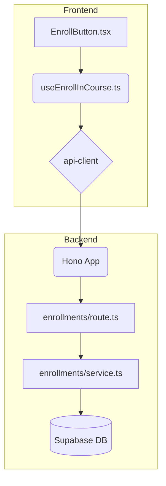

# 코스 수강신청 기능 구현 계획

## 1. 개요

`spec.md`에 명시된 코스 수강신청 기능을 구현하기 위해 `features/enrollments` 모듈을 신규 생성한다. 각 모듈은 `AGENTS.md`의 가이드라인에 따라 역할 분리 원칙을 준수한다.

| 모듈 이름 | 위치 | 설명 |
| --- | --- | --- |
| `enrollments/backend/schema.ts` | `src/features/` | 수강신청 API의 요청/응답 Zod 스키마 정의 |
| `enrollments/backend/service.ts` | `src/features/` | DB와 통신하며 핵심 비즈니스 로직 처리 |
| `enrollments/backend/route.ts` | `src/features/` | Hono API 라우트 정의 |
| `enrollments/backend/error.ts` | `src/features/` | 기능 관련 커스텀 에러 코드 정의 |
| `enrollments/hooks/useEnrollInCourse.ts` | `src/features/` | 수강신청 API를 호출하는 React Query `useMutation` 훅 |
| `enrollments/components/EnrollButton.tsx` | `src/features/` | `useEnrollInCourse` 훅을 사용하는 UI 컴포넌트 |
| `hono/app.ts` | `src/backend/` | 신규 생성된 `enrollments` 라우트 등록 (기존 파일 수정) |

## 2. Diagram

## 3. Implementation Plan

### Backend

#### `features/enrollments/backend/schema.ts`
- `enrollmentRequestSchema`: `courseId`를 `z.string().uuid()`로 정의하는 Zod 객체.
- `enrollmentResponseSchema`: `id`, `courseId`, `userId`, `enrolledAt`을 포함하는 Zod 객체.

#### `features/enrollments/backend/service.ts`
- `enrollInCourseService(userId: string, courseId: string)` 함수를 구현.
- **Unit Tests**:
    - `it('사용자가 공개된 강의를 성공적으로 수강신청한다')`
    - `it('이미 수강 중인 강의에 대해 409 Conflict 오류를 반환한다')`
    - `it('공개되지 않은(draft) 강의에 대해 400 Bad Request 오류를 반환한다')`
    - `it('존재하지 않는 강의 ID에 대해 404 Not Found 오류를 반환한다')`
    - `it('인증되지 않은 사용자에 대해 401 Unauthorized 오류를 반환한다')`

#### `features/enrollments/backend/route.ts`
- `POST /` 경로에 대한 Hono 라우터를 정의.
- 미들웨어를 통해 인증된 사용자 정보를 가져온다.
- `enrollmentRequestSchema`를 사용하여 요청 본문을 검증한다.
- `enrollInCourseService`를 호출하고, 결과를 `respond` 헬퍼로 반환한다.
- `registerEnrollmentsRoutes` 함수를 export 한다.

#### `backend/hono/app.ts`
- `import { registerEnrollmentsRoutes } from '@/features/enrollments/backend/route';`
- `createHonoApp` 함수 내에 `registerEnrollmentsRoutes(app);`를 추가한다.

### Frontend

#### `features/enrollments/hooks/useEnrollInCourse.ts`
- `@tanstack/react-query`의 `useMutation`을 사용하여 훅을 구현.
- `mutationFn`: `api-client.lms.enrollments.$post({ json: { courseId } })`를 호출.
- `onSuccess`: `useToast`를 사용하여 "수강신청이 완료되었습니다." 메시지 표시.
- `onError`: `extractApiErrorMessage`를 사용하여 백엔드에서 전달된 오류 메시지(예: "이미 수강 중인 코스입니다.")를 토스트로 표시.

#### `features/enrollments/components/EnrollButton.tsx`
- `'use client';` 지시어 사용.
- `courseId: string`을 props로 받는다.
- `useEnrollInCourse` 훅을 호출하여 `enroll`, `isPending` 상태를 가져온다.
- `isPending` 상태일 때 버튼을 비활성화하고 로딩 스피너를 표시한다.
- **QA Sheet**:
    - **Q1**: 컴포넌트 초기 렌더링 시 버튼 상태는?
        - **A1**: "수강신청" 텍스트와 함께 활성화 상태여야 한다.
    - **Q2**: "수강신청" 버튼 클릭 시 어떻게 동작하는가?
        - **A2**: 버튼이 비활성화되고 로딩 상태가 표시되어야 한다.
    - **Q3**: API 호출 성공 시 어떻게 되는가?
        - **A3**: "수강신청이 완료되었습니다." 토스트 메시지가 나타나고, 버튼은 "수강 중" 텍스트로 변경 후 비활성화되거나, 페이지가 리디렉션된다.
    - **Q4**: 이미 신청한 강의에 대해 버튼 클릭 시 어떻게 되는가?
        - **A4**: "이미 수강 중인 코스입니다." 오류 토스트 메시지가 나타나고, 버튼은 다시 활성화된다.
