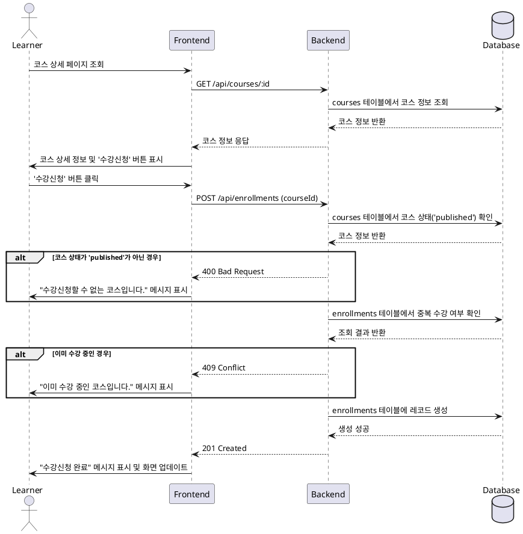

# 2. 코스 탐색 및 수강 신청 기능 명세

## 1. 유스케이스 상세

### Primary Actor
- Learner (수강생)

### Precondition
- 사용자는 시스템에 로그인된 상태이며, `Learner` 역할을 가지고 있다.

### Trigger
- 사용자가 코스 상세 페이지에서 "수강신청" 버튼을 클릭한다.

### Main Scenario (Success Flow)
1. 사용자가 코스 목록에서 특정 코스를 선택하여 상세 페이지로 이동한다.
2. 페이지에 "수강신청" 버튼이 표시된다.
3. 사용자가 "수강신청" 버튼을 클릭한다.
4. 프론트엔드(FE)는 백엔드(BE)에 수강신청 API를 요청한다. (e.g., `POST /api/enrollments` with `courseId`)
5. 백엔드(BE)는 다음 비즈니스 규칙을 검증한다.
    - 요청된 코스가 `published` 상태인지 확인한다.
    - 사용자가 이미 해당 코스를 신청했는지 중복 여부를 확인한다.
6. 검증을 통과하면, `enrollments` 테이블에 사용자 ID와 코스 ID를 포함한 새로운 수강 기록을 생성한다.
7. 백엔드(BE)는 프론트엔드(FE)에 성공 응답 (e.g., `201 Created`)을 반환한다.
8. 프론트엔드(FE)는 사용자에게 "수강신청이 완료되었습니다."와 같은 성공 메시지를 표시하고, 버튼 상태를 "수강 중"으로 변경하거나 대시보드로 이동시킨다.

### Edge Cases
- **게시되지 않은 코스 신청:** 코스 상태가 `published`가 아닐 경우, BE는 `400 Bad Request` 오류와 함께 "수강신청할 수 없는 코스입니다." 메시지를 반환한다.
- **중복 수강 신청:** 이미 `enrollments` 테이블에 동일한 `userId`와 `courseId` 조합이 존재할 경우, BE는 `409 Conflict` 오류와 함께 "이미 수강 중인 코스입니다." 메시지를 반환한다.
- **존재하지 않는 코스:** 요청된 `courseId`가 유효하지 않을 경우, BE는 `404 Not Found` 오류를 반환한다.
- **서버 오류:** 데이터베이스 연결 실패 등 서버 내부 문제 발생 시, `500 Internal Server Error`를 반환하고 FE는 사용자에게 일반적인 오류 메시지를 표시한다.

### Business Rules
- 오직 `published` 상태인 코스만 수강신청할 수 있다.
- 사용자는 동일한 코스를 중복하여 수강신청할 수 없다.
- 수강신청이 성공하면 `enrollments` 테이블에 기록이 남아야 한다.

## 2. Sequence Diagram

