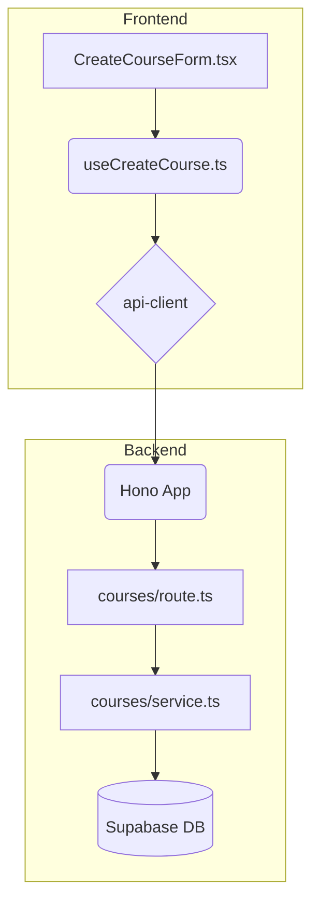

# 강의 생성 기능 구현 계획

## 1. 개요

`spec.md`에 명시된 강의 생성 기능을 구현하기 위해 `features/courses` 모듈을 신규 생성한다. 각 모듈은 `AGENTS.md`의 가이드라인에 따라 역할 분리 원칙을 준수한다.

| 모듈 이름 | 위치 | 설명 |
| --- | --- | --- |
| `courses/backend/schema.ts` | `src/features/` | 강의 생성 API의 요청/응답 Zod 스키마 정의 |
| `courses/backend/service.ts` | `src/features/` | DB와 통신하며 핵심 비즈니스 로직 처리 |
| `courses/backend/route.ts` | `src/features/` | Hono API 라우트 정의 |
| `courses/hooks/useCreateCourse.ts` | `src/features/` | 강의 생성 API를 호출하는 React Query `useMutation` 훅 |
| `courses/components/CreateCourseForm.tsx` | `src/features/` | `useCreateCourse` 훅을 사용하는 UI 컴포넌트 |
| `hono/app.ts` | `src/backend/` | 신규 생성된 `courses` 라우트 등록 (기존 파일 수정) |

## 2. Diagram

## 3. Implementation Plan

### Backend

#### `features/courses/backend/schema.ts`
- `createCourseRequestSchema`: `title`을 `z.string().min(1, "제목은 필수입니다.")`로 정의하는 Zod 객체.
- `createCourseResponseSchema`: `id`, `title`, `instructor_id`, `status`, `created_at`을 포함하는 Zod 객체.

#### `features/courses/backend/service.ts`
- `createCourseService(userId: string, title: string)` 함수를 구현.
- **Unit Tests**:
    - `it('강사가 유효한 제목으로 강의를 성공적으로 생성한다')`
    - `it('Learner 역할의 사용자가 강의 생성을 시도할 경우 403 Forbidden 오류를 반환한다 (미들웨어에서 처리되지만 서비스 레벨에서도 확인)')`
    - `it('제목이 비어있는 요청에 대해 400 Bad Request 오류를 반환한다 (라우트 레벨에서 처리)')`
    - `it('DB insert 실패 시 500 Internal Server Error를 반환한다')`

#### `features/courses/backend/route.ts`
- `POST /` 경로에 대한 Hono 라우터를 정의.
- 미들웨어를 통해 인증된 사용자 정보를 가져오고, `Instructor` 역할인지 확인한다.
- `createCourseRequestSchema`를 사용하여 요청 본문을 검증한다.
- `createCourseService`를 호출하고, 결과를 `respond` 헬퍼로 반환한다.
- `registerCoursesRoutes` 함수를 export 한다.

#### `backend/hono/app.ts`
- `import { registerCoursesRoutes } from '@/features/courses/backend/route';`
- `createHonoApp` 함수 내에 `registerCoursesRoutes(app);`를 추가한다.

### Frontend

#### `features/courses/hooks/useCreateCourse.ts`
- `@tanstack/react-query`의 `useMutation`을 사용하여 훅을 구현.
- `mutationFn`: `api-client.lms.courses.$post({ json: { title } })`를 호출.
- `onSuccess`: `useToast`를 사용하여 "강의가 성공적으로 생성되었습니다." 메시지 표시.
- `onError`: `extractApiErrorMessage`를 사용하여 백엔드 오류 메시지를 토스트로 표시.

#### `features/courses/components/CreateCourseForm.tsx`
- `'use client';` 지시어 사용.
- `react-hook-form`과 `zodResolver`를 사용하여 폼 상태 및 유효성 검사를 관리.
- `useCreateCourse` 훅을 호출하여 `createCourse`, `isPending` 상태를 가져온다.
- **QA Sheet**:
    - **Q1**: 컴포넌트 초기 렌더링 시 상태는?
        - **A1**: `title` 입력 필드가 비어있고, "생성하기" 버튼은 활성화 상태여야 한다.
    - **Q2**: `title`을 입력하지 않고 "생성하기" 버튼 클릭 시 어떻게 동작하는가?
        - **A2**: 입력 필드 아래에 "제목은 필수입니다." 유효성 검사 오류 메시지가 표시되고, API는 호출되지 않는다.
    - **Q3**: 유효한 `title`을 입력하고 "생성하기" 버튼 클릭 시 어떻게 동작하는가?
        - **A3**: 버튼이 비활성화되고 로딩 스피너가 표시되어야 한다.
    - **Q4**: API 호출 성공 시 어떻게 되는가?
        - **A4**: "강의가 성공적으로 생성되었습니다." 토스트 메시지가 나타나고, 입력 필드는 초기화된다.
    - **Q5**: API 호출 실패 시(e.g., 서버 오류) 어떻게 되는가?
        - **A5**: "강의 생성에 실패했습니다."와 같은 오류 토스트 메시지가 나타나고, 버튼은 다시 활성화된다.
