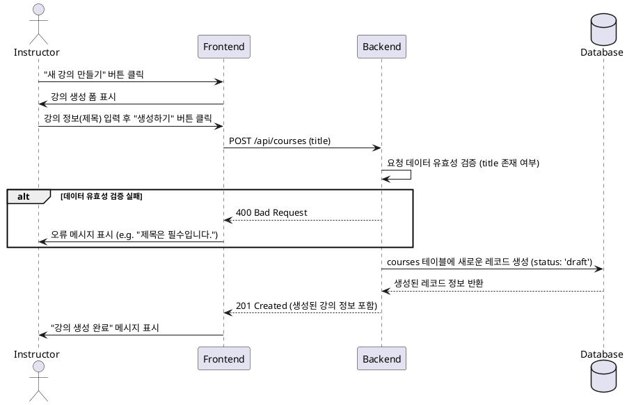

# 3. 강의 생성 기능 명세

## 1. 유스케이스 상세

### Primary Actor
- Instructor (강사)

### Precondition
- 사용자는 시스템에 로그인된 상태이며, `Instructor` 역할을 가지고 있다.

### Trigger
- 사용자가 "새 강의 만들기" 버튼을 클릭하고, 양식을 제출한다.

### Main Scenario (Success Flow)
1. 사용자가 "새 강의 만들기" 페이지로 이동하여 강의 **제목**을 입력한다.
2. 사용자가 "생성하기" 버튼을 클릭한다.
3. 프론트엔드(FE)는 백엔드(BE)에 강의 생성 API를 요청한다. (e.g., `POST /api/courses` with `{ title: "..." }`)
4. 백엔드(BE)는 다음 비즈니스 규칙을 검증한다.
    - 요청된 데이터의 유효성을 확인한다. (제목은 필수)
    - 요청한 사용자가 `Instructor` 역할인지 확인한다.
5. 검증을 통과하면, `courses` 테이블에 새로운 강의 기록을 생성한다.
    - `instructor_id`는 현재 로그인된 사용자의 ID로 설정한다.
    - `status`는 기본값인 `draft`로 설정한다.
6. 백엔드(BE)는 프론트엔드(FE)에 성공 응답 (e.g., `201 Created`)과 함께 생성된 강의 정보를 반환한다.
7. 프론트엔드(FE)는 사용자에게 "강의가 성공적으로 생성되었습니다."와 같은 성공 메시지를 표시한다.

### Edge Cases
- **입력값 오류:** 강의 제목이 누락된 경우, BE는 `400 Bad Request` 오류와 함께 "제목은 필수 입력 항목입니다." 메시지를 반환한다.
- **권한 없음:** `Learner` 등 `Instructor`가 아닌 역할의 사용자가 API를 호출할 경우, BE는 `403 Forbidden` 오류를 반환한다.
- **서버 오류:** 데이터베이스 연결 실패 등 서버 내부 문제 발생 시, `500 Internal Server Error`를 반환하고 FE는 사용자에게 일반적인 오류 메시지를 표시한다.

### Business Rules
- 오직 `Instructor` 역할의 사용자만 강의를 생성할 수 있다.
- 새로운 강의는 반드시 `title` (제목)을 포함해야 한다.
- 강의 생성 시 `status`는 항상 `draft`로 초기화된다.
- 강의를 생성한 사용자가 해당 강의의 `instructor_id`로 자동 설정된다.

## 2. Sequence Diagram

