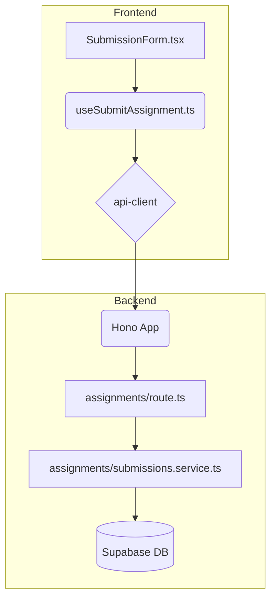

# 과제 제출 기능 구현 계획

## 1. 개요

`spec.md`에 명시된 과제 제출 기능을 구현하기 위해 `features/assignments` 모듈을 신규 생성하고, 제출 관련 로직을 그 하위에 구성한다. 이는 향후 과제 조회, 수정 등 다른 기능 추가 시 확장성을 고려한 설계이다.

| 모듈 이름 | 위치 | 설명 |
| --- | --- | --- |
| `assignments/backend/submissions.schema.ts` | `src/features/` | 과제 제출 API의 요청/응답 Zod 스키마 정의 |
| `assignments/backend/submissions.service.ts`| `src/features/` | DB와 통신하며 핵심 비즈니스 로직 처리 |
| `assignments/backend/route.ts` | `src/features/` | `POST /assignments/:id/submissions` Hono 라우트 정의 |
| `assignments/hooks/useSubmitAssignment.ts` | `src/features/` | 과제 제출 API를 호출하는 React Query `useMutation` 훅 |
| `assignments/components/SubmissionForm.tsx` | `src/features/` | `useSubmitAssignment` 훅을 사용하는 UI 컴포넌트 |
| `hono/app.ts` | `src/backend/` | 신규 생성된 `assignments` 라우트 등록 (기존 파일 수정) |

## 2. Diagram

## 3. Implementation Plan

### Backend

#### `features/assignments/backend/submissions.schema.ts`
- `submitAssignmentRequestSchema`: `content`를 `z.string().min(1, "내용은 필수입니다.")`로, `link`를 `z.string().url().optional()`로 정의.
- `submitAssignmentResponseSchema`: `id`, `content`, `link`, `status`, `late` 등을 포함하는 Zod 객체.

#### `features/assignments/backend/submissions.service.ts`
- `submitAssignmentService(userId, assignmentId, data)` 함수를 구현.
- **Unit Tests**:
    - `it('수강생이 마감일 전에 과제를 성공적으로 제출한다')`
    - `it('마감일 이후 지각 제출 허용 시, late: true로 제출된다')`
    - `it('마감일 이후 지각 제출 불허 시, 403 Forbidden 오류를 반환한다')`
    - `it('채점이 완료된 과제에 재제출 시도 시, 403 Forbidden 오류를 반환한다')`
    - `it('수강하지 않은 강의의 과제에 제출 시도 시, 403 Forbidden 오류를 반환한다')`
    - `it('DB insert/update 실패 시 500 Internal Server Error를 반환한다')`

#### `features/assignments/backend/route.ts`
- `POST /assignments/:assignmentId/submissions` 경로에 대한 Hono 라우터를 정의.
- 미들웨어를 통해 인증된 사용자(`userId`) 정보를 가져온다.
- `submitAssignmentRequestSchema`를 사용하여 요청 본문을 검증한다.
- `submitAssignmentService`를 호출하고, 결과를 `respond` 헬퍼로 반환한다.
- `registerAssignmentsRoutes` 함수를 export 한다.

#### `backend/hono/app.ts`
- `import { registerAssignmentsRoutes } from '@/features/assignments/backend/route';`
- `createHonoApp` 함수 내에 `registerAssignmentsRoutes(app);`를 추가한다.

### Frontend

#### `features/assignments/hooks/useSubmitAssignment.ts`
- `@tanstack/react-query`의 `useMutation`을 사용하여 훅을 구현.
- `mutationFn`: `api-client.assignments[param: { assignmentId }].submissions.$post({ json: { content, link } })`를 호출.
- `onSuccess`: `useToast`를 사용하여 "과제가 성공적으로 제출되었습니다." 메시지 표시 및 관련 쿼리 무효화.
- `onError`: `extractApiErrorMessage`를 사용하여 백엔드 오류 메시지를 토스트로 표시.

#### `features/assignments/components/SubmissionForm.tsx`
- `'use client';` 지시어 사용.
- `react-hook-form`과 `zodResolver`를 사용하여 폼 상태 및 유효성 검사를 관리.
- `useSubmitAssignment` 훅을 호출하여 `submitAssignment`, `isPending` 상태를 가져온다.
- **QA Sheet**:
    - **Q1**: 컴포넌트 초기 렌더링 시 상태는?
        - **A1**: `content` 텍스트 영역과 `link` 입력 필드가 비어있고, "제출하기" 버튼은 활성화 상태여야 한다.
    - **Q2**: `content`를 입력하지 않고 "제출하기" 버튼 클릭 시 어떻게 동작하는가?
        - **A2**: 텍스트 영역 아래에 "내용은 필수입니다." 유효성 검사 오류 메시지가 표시되고, API는 호출되지 않는다.
    - **Q3**: 유효한 `content`를 입력하고 "제출하기" 버튼 클릭 시 어떻게 동작하는가?
        - **A3**: 버튼이 비활성화되고 로딩 스피너가 표시되어야 한다.
    - **Q4**: API 호출 성공 시 어떻게 되는가?
        - **A4**: "과제가 성공적으로 제출되었습니다." 토스트 메시지가 나타나고, 폼이 비활성화되거나 "제출 완료" 상태로 변경된다.
    - **Q5**: API 호출 실패 시(e.g., 마감됨) 어떻게 되는가?
        - **A5**: "마감된 과제입니다."와 같은 오류 토스트 메시지가 나타나고, 버튼은 다시 활성화된다.
