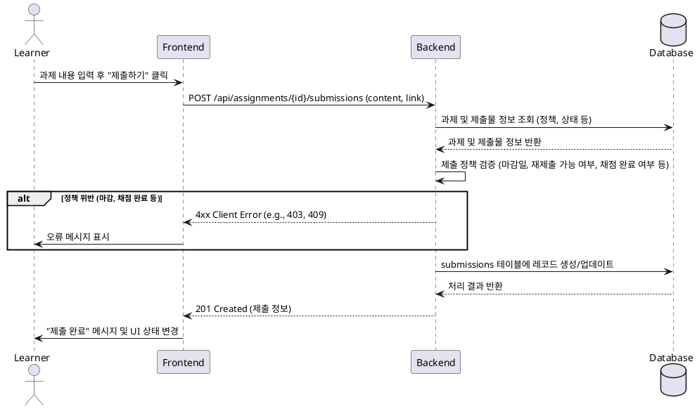

# 4. 과제 제출 기능 명세

## 1. 유스케이스 상세

### Primary Actor
- Learner (학습자)

### Precondition
- 사용자는 시스템에 로그인된 상태이며, `Learner` 역할을 가지고 있다.
- 사용자는 과제가 포함된 강의에 등록되어 있다.
- 사용자는 제출하려는 과제의 상세 페이지에 있다.

### Trigger
- 사용자가 과제 제출 양식을 작성하고 "제출하기" 버튼을 클릭한다.

### Main Scenario (Success Flow)
1. 사용자가 제출할 내용(텍스트)과 참고 링크(선택 사항)를 입력한다.
2. 사용자가 "제출하기" 버튼을 클릭한다.
3. 프론트엔드(FE)는 백엔드(BE)에 과제 제출 API를 요청한다. (e.g., `POST /api/assignments/{assignmentId}/submissions`)
4. 백엔드(BE)는 **Business Rules**에 명시된 규칙에 따라 요청을 검증한다.
5. 검증을 통과하면 `submissions` 테이블에 새로운 제출 기록을 생성하거나, 기존 기록의 내용을 **단순 덮어쓰기 방식으로 업데이트**한다.
    - `status`는 `submitted`로 설정한다.
    - `late`는 최종 제출 시간을 기준으로 `true` 또는 `false`로 설정한다.
6. 백엔드(BE)는 프론트엔드(FE)에 성공 응답 (e.g., `201 Created`)과 함께 제출된 정보를 반환한다.
7. 프론트엔드(FE)는 사용자에게 "과제가 성공적으로 제출되었습니다." 메시지를 표시하고, UI 상태를 '제출됨' 또는 '지각 제출'로 업데이트한다.

### Edge Cases
- **입력값 오류**: 텍스트 필드가 비어있을 경우, BE는 `400 Bad Request`와 "제출 내용은 필수입니다." 메시지를 반환한다.
- **권한 없음**: 수강하지 않은 강의의 과제에 제출을 시도할 경우, BE는 `403 Forbidden` 오류를 반환한다.
- **정책 위반**: 아래 `Business Rules`에 명시된 제출 정책(마감, 재제출 불가 등)을 위반할 경우, BE는 해당하는 오류(e.g., `403 Forbidden`, `409 Conflict`)와 명확한 사유를 반환한다.

### Business Rules
1.  **제출 자격**: 오직 해당 강의를 수강하는 `Learner`만 과제를 제출할 수 있다.
2.  **필수 입력**: 제출 내용(텍스트)은 필수 항목이다.
3.  **지각 처리 기준**: 모든 제출(최초/재제출)은 **최종 제출 시점**을 기준으로 지각(`late: true`) 여부를 판단한다.
4.  **재제출 정책**:
    - **데이터 처리**: 재제출 시, 기존 제출물의 내용은 **단순 덮어쓰기** 되며 별도의 이력은 관리하지 않는다.
    - **강사 요청**: 과제 정책상 '재제출 불가'이더라도, 강사가 '재제출 요청'을 한 경우(상태: `resubmission_required`)에는 예외적으로 제출이 허용된다.
    - **채점 후 재제출 불가**: 일단 '채점 완료'(`graded`)된 제출물은 어떠한 경우에도 재제출할 수 없다. 위반 시 `403 Forbidden` 오류와 "이미 채점이 완료된 과제입니다." 메시지를 반환한다.

## 2. Sequence Diagram

