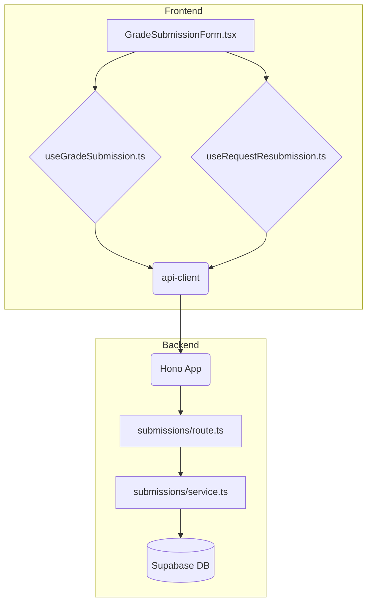

# 과제 채점 및 피드백 기능 구현 계획

## 1. 개요

`spec.md`에 명시된 과제 채점 및 재제출 요청 기능을 구현하기 위해 `features/submissions` 모듈을 신규 생성합니다. 이는 제출물(Submission) 리소스에 대한 CRUD 로직을 명확히 분리하여 관리하기 위함입니다.

| 모듈 이름 | 위치 | 설명 |
| --- | --- | --- |
| `submissions/backend/schema.ts` | `src/features/` | 채점 및 재제출 요청 API의 Zod 스키마 정의 |
| `submissions/backend/service.ts`| `src/features/` | DB와 통신하며 채점 관련 비즈니스 로직 처리 |
| `submissions/backend/route.ts` | `src/features/` | `PATCH /submissions/:id` 등 Hono 라우트 정의 |
| `submissions/hooks/useGradeSubmission.ts` | `src/features/` | 과제 채점 API를 호출하는 React Query `useMutation` 훅 |
| `submissions/hooks/useRequestResubmission.ts` | `src/features/` | 재제출 요청 API를 호출하는 `useMutation` 훅 |
| `submissions/components/GradeSubmissionForm.tsx` | `src/features/` | 채점 및 재제출 요청을 위한 UI 컴포넌트 |
| `hono/app.ts` | `src/backend/` | 신규 생성된 `submissions` 라우트 등록 (기존 파일 수정) |

## 2. Diagram

## 3. Implementation Plan

### Backend

#### `features/submissions/backend/schema.ts`
- `gradeSubmissionRequestSchema`: `score`를 `z.number().min(0).max(100)`, `feedback`을 `z.string().min(1, "피드백은 필수입니다.")`로 정의합니다.
- `gradeSubmissionResponseSchema`: 업데이트된 제출물 정보를 포함하는 Zod 객체를 정의합니다.

#### `features/submissions/backend/service.ts`
- `gradeSubmissionService(submissionId, data, instructorId)` 함수를 구현합니다.
- `requestResubmissionService(submissionId, instructorId)` 함수를 구현합니다.
- **Unit Tests**:
    - `it('강사가 자신의 과제 제출물을 성공적으로 채점한다')`
    - `it('강사가 성공적으로 재제출을 요청하면, 제출물 상태가 resubmission_required로 변경된다')`
    - `it('자신의 과제가 아닌 제출물을 채점 시도 시, 403 Forbidden 오류를 반환한다')`
    - `it('점수가 0-100 범위를 벗어날 경우, 400 Bad Request 오류를 반환한다')`
    - `it('피드백이 비어있을 경우, 400 Bad Request 오류를 반환한다')`
    - `it('이미 채점된 과제를 다시 채점하려 할 경우, 409 Conflict 오류를 반환한다')`

#### `features/submissions/backend/route.ts`
- `PATCH /submissions/:id` 라우터를 정의하여 `gradeSubmissionService`를 호출합니다.
- `PATCH /submissions/:id/request-resubmission` 라우터를 정의하여 `requestResubmissionService`를 호출합니다.
- 미들웨어를 통해 인증된 사용자의 역할(`Instructor`)과 ID를 확인하고, `service`에 전달하여 권한을 검증하도록 합니다.
- `registerSubmissionsRoutes` 함수를 export 합니다.

#### `backend/hono/app.ts`
- `import { registerSubmissionsRoutes } from '@/features/submissions/backend/route';`
- `createHonoApp` 함수 내에 `registerSubmissionsRoutes(app);`를 추가합니다.

### Frontend

#### `features/submissions/hooks/useGradeSubmission.ts`
- `useMutation`을 사용하여 구현합니다.
- `mutationFn`: `api-client.submissions[param: { id }].$patch({ json: { score, feedback } })`를 호출합니다.
- `onSuccess`: "채점이 완료되었습니다." 토스트 메시지를 표시하고 관련 쿼리를 무효화합니다.
- `onError`: API 오류 메시지를 토스트로 표시합니다.

#### `features/submissions/hooks/useRequestResubmission.ts`
- `useMutation`을 사용하여 구현합니다.
- `mutationFn`: `api-client.submissions[param: { id }]['request-resubmission'].$patch()`를 호출합니다.
- `onSuccess`: "재제출을 요청했습니다." 토스트 메시지를 표시하고 관련 쿼리를 무효화합니다.

#### `features/submissions/components/GradeSubmissionForm.tsx`
- `react-hook-form`과 `zodResolver`를 사용하여 폼 상태 및 유효성 검사를 관리합니다.
- `useGradeSubmission`과 `useRequestResubmission` 훅을 사용합니다.
- **QA Sheet**:
    - **Q1**: 컴포넌트 초기 렌더링 시 상태는?
        - **A1**: `score`와 `feedback` 필드가 비어있고, "채점 완료" 및 "재제출 요청" 버튼이 활성화 상태여야 합니다.
    - **Q2**: `score`에 100 초과 값을 입력하고 "채점 완료" 클릭 시 어떻게 동작하는가?
        - **A2**: "점수는 0과 100 사이여야 합니다."와 같은 유효성 검사 오류가 표시되고 API는 호출되지 않습니다.
    - **Q3**: `feedback`을 비운 채 "채점 완료" 클릭 시 어떻게 동작하는가?
        - **A3**: "피드백은 필수입니다." 오류가 표시되고 API는 호출되지 않습니다.
    - **Q4**: 유효한 값으로 "채점 완료" 클릭 시 어떻게 동작하는가?
        - **A4**: 버튼이 비활성화되고 로딩 상태가 표시됩니다. 성공 시 "채점이 완료되었습니다." 토스트가 나타나고 폼이 비활성화되거나 '채점 완료' 상태로 변경됩니다.
    - **Q5**: "재제출 요청" 버튼 클릭 시 어떻게 동작하는가?
        - **A5**: 버튼이 비활성화되고 로딩 상태가 표시됩니다. 성공 시 "재제출을 요청했습니다." 토스트가 나타나고 UI가 업데이트됩니다.
