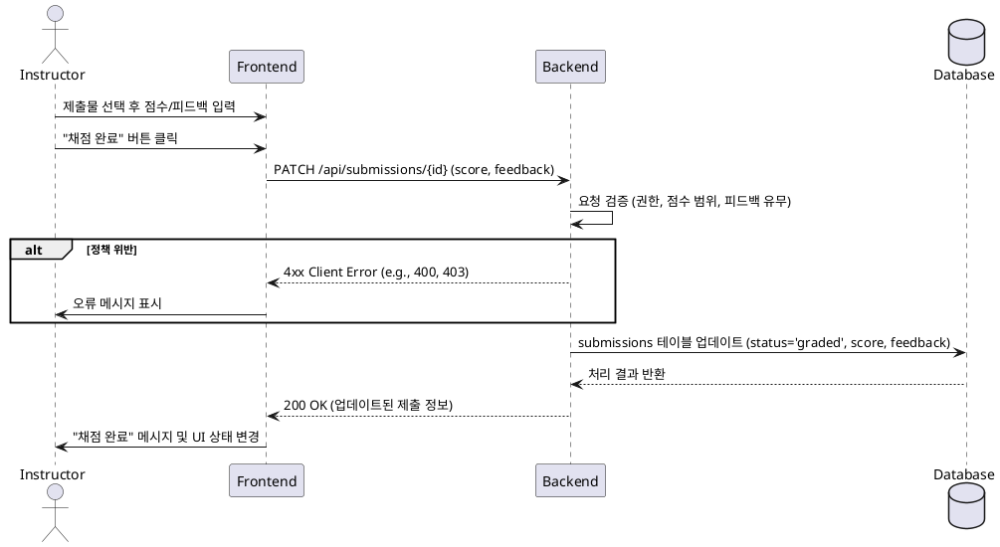
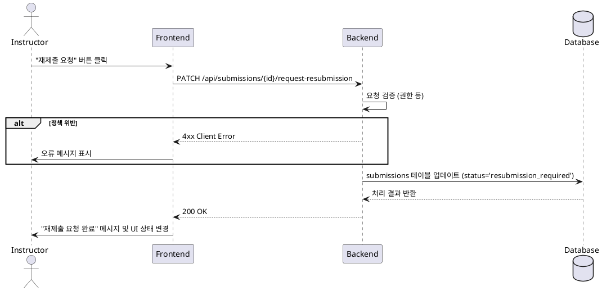

# 5. 과제 채점 및 피드백 기능 명세

## 1. 유스케이스 상세

### Primary Actor
- Instructor (강사)

### Precondition
- 사용자는 시스템에 로그인된 상태이며, `Instructor` 역할을 가지고 있다.
- 사용자는 자신이 생성한 과제의 제출물 목록 페이지에 있다.

### Trigger
- 사용자가 특정 제출물에 대해 점수와 피드백을 입력하고 "채점 완료" 버튼을 클릭하거나, "재제출 요청" 버튼을 클릭한다.

### Main Scenario (Success Flow - 채점)
1. 사용자가 채점할 제출물을 선택한다.
2. 사용자가 점수(0-100)와 피드백(텍스트)을 입력한다.
3. 사용자가 "채점 완료" 버튼을 클릭한다.
4. 프론트엔드(FE)는 백엔드(BE)에 제출물 업데이트 API를 요청한다. (e.g., `PATCH /api/submissions/{submissionId}`)
5. 백엔드(BE)는 **Business Rules**에 따라 요청을 검증한다.
6. 검증을 통과하면 `submissions` 테이블의 해당 레코드를 업데이트한다.
    - `score`와 `feedback` 필드를 저장한다.
    - `status`를 `graded`로 변경한다.
7. 백엔드(BE)는 프론트엔드(FE)에 성공 응답 (e.g., `200 OK`)과 함께 업데이트된 정보를 반환한다.
8. 프론트엔드(FE)는 사용자에게 "채점이 완료되었습니다." 메시지를 표시하고, UI 상태를 '채점 완료'로 업데이트한다.

### Alternative Scenario (재제출 요청)
1. 사용자가 특정 제출물에 대해 "재제출 요청" 버튼을 클릭한다.
2. 프론트엔드(FE)는 백엔드(BE)에 제출물 상태 변경 API를 요청한다.
3. 백엔드(BE)는 `submissions` 테이블의 `status`를 `resubmission_required`로 변경한다.
4. 백엔드(BE)는 성공 응답을 반환한다.
5. 프론트엔드(FE)는 "재제출을 요청했습니다." 메시지를 표시하고 UI를 업데이트한다. 이후 해당 학습자는 과제를 다시 제출할 수 있게 된다.

### Edge Cases
- **입력값 오류**: 점수가 0-100 범위를 벗어나거나 피드백이 비어있을 경우, BE는 `400 Bad Request`와 오류 메시지를 반환한다.
- **권한 없음**: 자신의 코스가 아닌 과제의 제출물을 채점하려 할 경우, BE는 `403 Forbidden` 오류를 반환한다.
- **잘못된 상태**: 이미 채점이 완료된 과제를 다시 채점하려고 시도하는 등, 상태 전이 규칙에 맞지 않는 요청 시 BE는 `409 Conflict` 오류를 반환한다.

### Business Rules
1.  **채점 권한**: 오직 해당 코스를 소유한 `Instructor`만 제출물을 채점하고 피드백을 제공할 수 있다.
2.  **점수 범위**: 점수는 0점에서 100점 사이의 정수여야 한다.
3.  **피드백 필수**: 채점 시 피드백 텍스트는 필수 입력 항목이다.
4.  **상태 관리**:
    - 채점이 완료되면 제출물 상태는 `graded`가 된다.
    - 재제출이 요청되면 상태는 `resubmission_required`가 되며, 학습자는 다시 제출할 수 있다.
5.  **단순성 원칙**: 채점 취소나 수정 기능은 고려하지 않는다. 채점은 한 번만 수행하는 것을 원칙으로 한다.

## 2. Sequence Diagram

