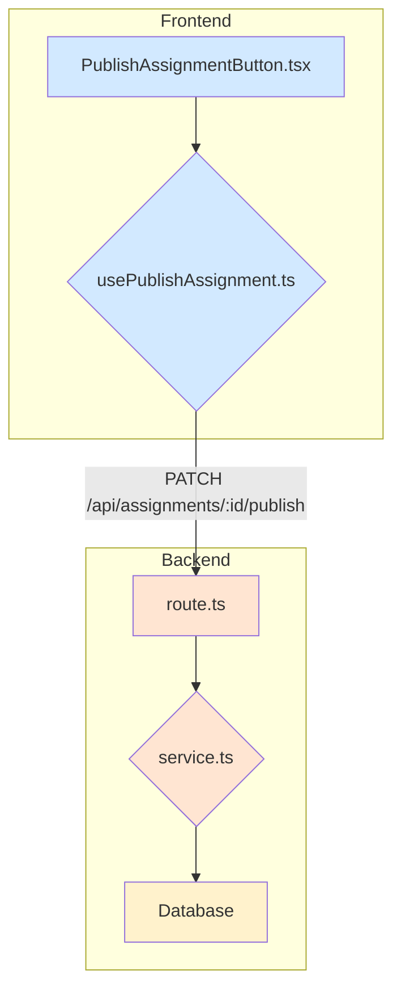

# Plan: 과제 게시 기능 구현 계획

## 1. 개요

`spec.md`에 명시된 '과제 게시' 유스케이스를 구현하기 위한 프론트엔드 및 백엔드 모듈 설계안입니다. `AGENTS.md`의 가이드라인에 따라 `src/features/assignments` 경로에 필요한 모듈을 추가 및 수정합니다.

| 모듈 유형 | 모듈 이름 | 위치 | 설명 |
| :--- | :--- | :--- | :--- |
| **Backend** | `schema.ts` | `src/features/assignments/backend/` | 과제 상태 변경 관련 스키마를 추가합니다. |
| | `service.ts` | `src/features/assignments/backend/` | 과제 게시 비즈니스 로직을 담당하는 서비스를 구현합니다. |
| | `route.ts` | `src/features/assignments/backend/` | `PATCH /assignments/:id/publish` 엔드포인트를 추가합니다. |
| **Frontend** | `usePublishAssignment.ts` | `src/features/assignments/hooks/` | 과제 게시 API를 호출하는 `useMutation` 훅을 구현합니다. |
| | `PublishAssignmentButton.tsx` | `src/features/assignments/components/` | 게시 버튼, 확인 다이얼로그, API 호출 로직을 포함한 UI 컴포넌트입니다. |

---

## 2. Diagram

---

## 3. Implementation Plan\n\n---\n\n### 참고 구현 (Reference Implementations)\n\n본 계획에 따라 '과제 게시' 기능을 구현할 때, 이미 코드베이스에 구현된 **과제 채점 (`submissions`)** 기능의 패턴을 참고하면 좋습니다. 두 기능 모두 특정 리소스의 상태를 변경하고, 소유권을 검증하는 유사한 흐름을 가집니다.\n\n- **Backend (`service.ts`, `route.ts`) 참고**: `src/features/submissions/backend/`\n  - `service.ts`의 `gradeSubmissionService`는 **리소스 소유권(강사)을 확인**하고, **상태(이미 채점되었는지)를 검증**한 후 DB를 업데이트합니다. 이는 `publishAssignmentService`가 구현해야 할 로직과 매우 유사합니다.\n  - `route.ts`는 `PATCH /submissions/:id` 형태의 **상태 변경 엔드포인트**를 어떻게 구성하고 서비스와 연결하는지에 대한 좋은 예시입니다.\n\n- **Frontend (`useMutation` 훅) 참고**: `src/features/submissions/hooks/`\n  - `useGradeSubmission.ts`와 `useRequestResubmission.ts`는 `useMutation`을 사용하여 **API 호출, 성공/에러 처리, 쿼리 무효화**를 수행하는 표준적인 방법을 보여줍니다. `usePublishAssignment` 훅은 이 구조를 그대로 따르면 됩니다.\n

### A. Backend

#### 1. `schema.ts` 수정
- **위치**: `src/features/assignments/backend/schema.ts`
- **작업**: 기존에 `submissions` 관련 스키마만 있었다면, `assignments` 자체에 대한 스키마를 정의하거나 확장합니다. `status` 필드에 `draft`, `published`, `closed` 등의 `enum`을 정의합니다.

#### 2. `service.ts` 구현
- **위치**: `src/features/assignments/backend/service.ts`
- **작업**: `publishAssignmentService` 함수를 구현합니다.
    - **Input**: `assignmentId`, `instructorId`
    - **Logic**:
        1.  `assignmentId`로 과제를 조회합니다.
        2.  과제가 존재하지 않으면 `NOT_FOUND` 에러를 반환합니다.
        3.  과제의 `course` 소유주가 `instructorId`와 일치하는지 확인하고, 다르면 `UNAUTHORIZED` 에러를 반환합니다.
        4.  과제 상태가 `draft`가 아니면 `ALREADY_PUBLISHED` (409 Conflict) 에러를 반환합니다.
        5.  과제 상태를 `published`로 변경하고 DB에 저장합니다.
        6.  성공 시, 업데이트된 과제 데이터를 반환합니다.

- **Unit Test (Business Logic)**
    - `[성공]` 소유주이고 상태가 draft일 때, published로 변경되는가?
    - `[실패]` 소유주가 아닐 때, 403 에러를 반환하는가?
    - `[실패]` 상태가 draft가 아닐 때, 409 에러를 반환하는가?

#### 3. `route.ts` 수정
- **위치**: `src/features/assignments/backend/route.ts`
- **작업**: `PATCH /assignments/:id/publish` 라우트를 추가합니다.
    1.  Hono 인스턴스에 라우트를 등록합니다.
    2.  미들웨어에서 인증된 사용자 정보를 가져옵니다.
    3.  `publishAssignmentService`를 호출하고 결과를 `respond` 헬퍼로 반환합니다.

### B. Frontend

#### 1. `usePublishAssignment.ts` 구현
- **위치**: `src/features/assignments/hooks/usePublishAssignment.ts`
- **작업**: `useMutation`을 사용하여 훅을 구현합니다.
    - **`mutationFn`**: `apiClient.patch(`/assignments/${assignmentId}/publish
`)`를 호출합니다.
    - **`onSuccess`**: "과제가 게시되었습니다." 토스트를 표시하고, `queryClient.invalidateQueries`를 호출하여 과제 목록 캐시를 무효화합니다.
    - **`onError`**: `extractApiErrorMessage`를 사용하여 백엔드 에러 메시지를 토스트로 표시합니다.

#### 2. `PublishAssignmentButton.tsx` 구현
- **위치**: `src/features/assignments/components/PublishAssignmentButton.tsx`
- **작업**: 재사용 가능한 버튼 컴포넌트를 구현합니다.
    - **Props**: `assignmentId`
    - **State**: `usePublishAssignment` 훅을 호출하여 `mutate` 함수와 `isPending` 상태를 가져옵니다.
    - **UI**: `shadcn-ui`의 `AlertDialog`와 `Button`을 사용합니다.
        - 평상시에는 '게시하기' 버튼을 표시합니다.
        - 버튼 클릭 시, `AlertDialog` 확인창을 엽니다.
        - 확인창의 '확인' 버튼을 클릭하면 `mutate(assignmentId)`를 호출합니다.
        - API 호출 중(`isPending === true`)에는 버튼을 비활성화하고 로딩 상태를 표시합니다.

- **QA Sheet (Presentation)**
    - `[확인]` 버튼이 정상적으로 렌더링 되는가?
    - `[확인]` 버튼 클릭 시, 확인 다이얼로그가 나타나는가?
    - `[확인]` API 요청 중에 버튼이 비활성화되고 로딩 스피너가 표시되는가?
    - `[확인]` API 요청 성공/실패 시 다이얼로그가 닫히는가?
