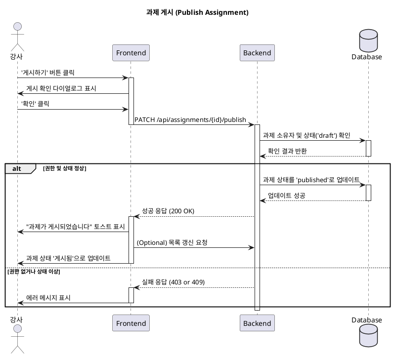

# Use Case: 과제 게시 (Publish Assignment)

## 1. 유스케이스 개요

강사가 작성 완료한 초안(Draft) 상태의 과제를 수강생들에게 공개하여 제출받을 수 있도록 '게시(Published)' 상태로 전환하는 기능의 명세입니다.

---

- **Primary Actor**: 강사 (Instructor)

- **Precondition**:
    - 강사가 시스템에 로그인 되어 있다.
    - 강사가 자신이 소유한 코스의 과제 관리 페이지에 접근해 있다.
    - 게시하려는 과제가 '초안(Draft)' 상태로 존재한다.

- **Trigger**:
    - 강사가 과제 목록에서 특정 과제의 '게시하기(Publish)' 버튼을 클릭한다.

---

## 2. 시나리오

### Main Scenario (정상 흐름)

1.  강사가 '게시하기' 버튼을 클릭합니다.
2.  시스템(FE)은 "과제를 게시하시겠습니까?" 확인창을 표시합니다.
3.  강사가 '확인'을 클릭합니다.
4.  시스템(FE)은 백엔드에 해당 과제의 상태를 'published'로 변경하도록 요청합니다.
5.  시스템(BE)은 요청한 강사가 과제의 소유주가 맞는지 권한을 검증합니다.
6.  시스템(BE)은 과제의 상태를 'published'로 업데이트하고 데이터베이스에 저장합니다.
7.  시스템(BE)은 성공적으로 처리되었음을 프론트엔드에 응답합니다.
8.  시스템(FE)은 "과제가 게시되었습니다."라는 확인 메시지(토스트)를 표시하고, 과제 목록을 갱신하여 상태가 '게시됨'으로 변경된 것을 보여줍니다.

### Edge Cases (예외 처리)

-   **권한 없음**: 자신의 코스가 아닌 과제를 게시하려고 시도하면, 시스템은 "권한이 없습니다." 오류(403 Forbidden)를 반환합니다.
-   **잘못된 상태**: 이미 '게시됨' 또는 '마감됨' 상태인 과제를 다시 게시하려고 하면, "이미 처리된 과제입니다." 오류(409 Conflict)를 반환합니다.
-   **네트워크 오류**: 요청 처리 중 연결이 끊기면, "요청에 실패했습니다. 잠시 후 다시 시도해주세요." 메시지를 표시합니다.

---

## 3. 비즈니스 규칙

-   오직 '초안(draft)' 상태의 과제만 '게시됨(published)' 상태로 변경할 수 있습니다.
-   과제가 '게시됨' 상태로 변경되면, 해당 코스를 수강하는 모든 수강생에게 과제가 노출됩니다.
-   게시된 이후에는 과제의 공정성을 위해 일부 핵심 정보(예: 점수 비중)는 수정이 제한될 수 있습니다.

---

## 4. Sequence Diagram

