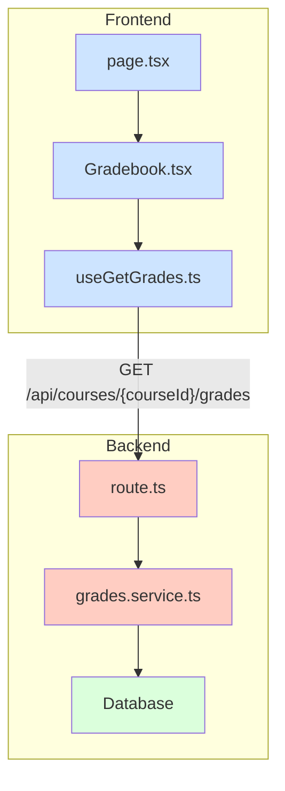

# Implementation Plan: 7. 성적 및 피드백 열람 (Learner) - Simplified

## 1. 개요

`spec.md`의 간소화된 요구사항에 따라, 학습자가 코스별 성적과 피드백을 조회하는 최소 기능을 구현합니다. 복잡한 계산 로직을 제외하고 데이터 조회 및 표시에 집중합니다.

| 모듈 유형 | 모듈 이름 | 위치 | 설명 |
| --- | --- | --- | --- |
| **Backend** | `grades.schema.ts` | `src/features/courses/backend/` | 성적 조회 API의 응답 DTO(Zod 스키마)를 정의합니다. |
| | `grades.service.ts` | `src/features/courses/backend/` | DB에서 성적 데이터를 조회하는 비즈니스 로직을 처리합니다. |
| | `route.ts` | `src/features/courses/backend/` | 기존 `courses` 라우터에 `GET /{courseId}/grades` 엔드포인트를 추가합니다. |
| **Frontend** | `dto.ts` | `src/features/courses/lib/` | 백엔드의 `grades.schema.ts`에서 정의된 타입을 re-export 합니다. |
| | `useGetGrades.ts` | `src/features/courses/hooks/` | 성적 데이터를 조회하는 React Query `useQuery` 훅입니다. |
| | `Gradebook.tsx` | `src/features/courses/components/` | 성적 및 피드백을 표시하는 UI 컴포넌트입니다. |
| | `page.tsx` | `src/app/(protected)/courses/[courseId]/grades/` | `Gradebook` 컴포넌트를 호스팅하는 페이지입니다. |

## 2. Diagram

## 3. Implementation Plan

### Backend

#### 1. `grades.schema.ts`
- `graded_assignment_schema`: 개별 과제의 성적 정보를 정의합니다.
  - `id`, `title` (과제 정보)
  - `submission`: `score`, `feedback`을 포함하는 제출 정보 객체 (nullable)
- `grades_response_schema`: 최종 API 응답 형태를 정의합니다.
  - `graded_assignment_schema`의 배열

#### 2. `grades.service.ts`
- `getGradesForCourse(courseId: string, userId: string)` 함수를 구현합니다.
- **주요 로직**: `assignments`와 `submissions` 테이블을 조인하여 사용자의 제출 기록과 점수, 피드백을 가져옵니다.
- **Unit Test**: 필수적인 권한 검증 테스트에 집중합니다.
  - `it('should return failure if user is not enrolled')`: 수강생이 아닌 사용자의 요청을 거부하는지 검증합니다.

#### 3. `route.ts`
- 기존 `courses` Hono 앱에 `.get('/:courseId/grades', ...)` 핸들러를 추가합니다.
- `withSupabase` 미들웨어에서 `user`를 가져와 `grades.service`로 전달합니다.

### Frontend

#### 1. `useGetGrades.ts`
- `useQuery`를 사용하여 `GET /api/courses/{courseId}/grades`를 호출하는 훅을 생성합니다.
- `courseId`가 있을 때만 쿼리가 실행되도록 `enabled: !!courseId` 옵션을 사용합니다.

#### 2. `Gradebook.tsx`
- `useGetGrades` 훅의 `data`, `isLoading`, `isError` 상태를 사용합니다.
- **최소 기능 QA**:
  - **Loading**: 로딩 중일 때 "로딩 중..." 메시지가 표시되는가?
  - **Error**: API 에러 발생 시 "성적을 불러오지 못했습니다." 메시지가 표시되는가?
  - **Data Display**:
    - `Table` 컴포넌트에 과제 목록이 올바르게 표시되는가? (과제명, 점수, 피드백)
    - 채점 전 과제의 점수란이 "채점 중"으로 표시되는가?

#### 3. `page.tsx`
- `useParams`를 사용해 URL에서 `courseId`를 추출하고 `Gradebook` 컴포넌트에 전달합니다.