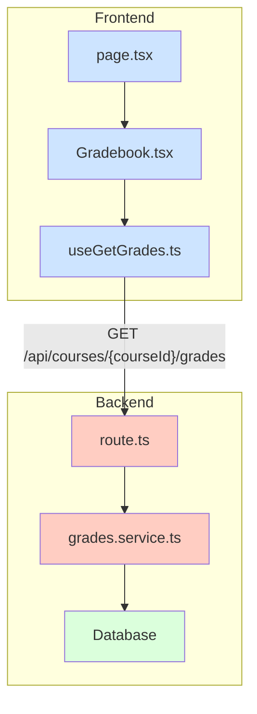

# Implementation Plan: 7. 성적 및 피드백 열람 (Learner)

## 1. 개요

`spec.md`의 요구사항에 따라, 학습자가 코스별 성적과 피드백을 조회하는 기능을 구현합니다. API 엔드포인트의 RESTful한 구조를 고려하여, 기존 `courses` 피처 내에 관련 모듈을 추가하는 방식으로 설계합니다.

| 모듈 유형 | 모듈 이름 | 위치 | 설명 |
| --- | --- | --- | --- |
| **Backend** | `grades.schema.ts` | `src/features/courses/backend/` | 성적 조회 API의 응답 DTO(Zod 스키마)를 정의합니다. |
| | `grades.service.ts` | `src/features/courses/backend/` | DB에서 성적 데이터를 조회하고 총점을 계산하는 비즈니스 로직을 처리합니다. |
| | `route.ts` | `src/features/courses/backend/` | 기존 `courses` 라우터에 `GET /{courseId}/grades` 엔드포인트를 추가합니다. |
| **Frontend** | `dto.ts` | `src/features/courses/lib/` | 백엔드의 `grades.schema.ts`에서 정의된 타입을 re-export 합니다. |
| | `useGetGrades.ts` | `src/features/courses/hooks/` | 성적 데이터를 조회하는 React Query `useQuery` 훅입니다. |
| | `Gradebook.tsx` | `src/features/courses/components/` | 성적 및 피드백을 표시하는 UI 컴포넌트입니다. |
| | `page.tsx` | `src/app/(protected)/courses/[courseId]/grades/` | `Gradebook` 컴포넌트를 호스팅하는 페이지입니다. |

## 2. Diagram

## 3. Implementation Plan

### Backend

#### 1. `grades.schema.ts`
- `submission_status_schema`: `submitted`, `late`, `graded`, `resubmission_required` 등 제출 상태를 정의하는 Zod `enum`을 생성합니다.
- `graded_assignment_schema`: 개별 과제의 성적 정보를 정의합니다.
  - `id`, `title`, `due_date`, `weight` (과제 가중치)
  - `submission`: `status`, `score`, `feedback`, `submitted_at` 등을 포함하는 제출 정보 객체 (nullable)
- `grades_response_schema`: 최종 API 응답 형태를 정의합니다.
  - `assignments`: `graded_assignment_schema`의 배열
  - `total_score`: 계산된 총점

#### 2. `grades.service.ts`
- `getGradesForCourse(courseId: string, userId: string): Promise<HandlerResult<...>>` 함수를 구현합니다.
- **Unit Test (jest)**:
  - `it('should calculate the total score correctly')`: 정상적인 성적 데이터에 대해 총점이 정확히 계산되는지 검증합니다.
  - `it('should exclude ungraded assignments from total score')`: 채점되지 않은 과제는 총점 계산에서 제외되는지 확인합니다.
  - `it('should return failure if user is not enrolled')`: 수강생이 아닌 사용자의 요청에 대해 403 Forbidden 에러를 반환하는지 검증합니다.
  - `it('should handle cases with no submissions')`: 제출물이 하나도 없을 때 빈 배열과 총점 0을 반환하는지 확인합니다.

#### 3. `route.ts`
- 기존 `courses` Hono 앱에 `.get('/:courseId/grades', ...)` 핸들러를 추가합니다.
- `withSupabase` 미들웨어에서 `user`를 가져와 `grades.service`로 전달합니다.
- `respond(c, result)` 헬퍼를 사용해 서비스 결과를 반환합니다.

### Frontend

#### 1. `useGetGrades.ts`
- `useQuery`를 사용하여 `GET /api/courses/{courseId}/grades`를 호출하는 훅을 생성합니다.
- `courseId`를 인자로 받으며, `enabled: !!courseId` 옵션을 사용해 ID가 있을 때만 쿼리가 실행되도록 합니다.
- `staleTime`을 1분으로 설정합니다.

#### 2. `Gradebook.tsx`
- `useGetGrades` 훅의 `data`, `isLoading`, `isError` 상태를 사용합니다.
- **QA Sheet**:
  - **Loading**: 로딩 중일 때 스켈레톤 UI 또는 스피너가 표시되는가?
  - **Error**: API 에러 발생 시 "성적을 불러오지 못했습니다." 메시지가 표시되는가?
  - **Empty State**: 제출/채점된 과제가 없을 때 "표시할 성적이 없습니다." 메시지가 표시되는가?
  - **Data Display**:
    - 총점이 `Card` 컴포넌트에 정확히 표시되는가? (예: "총점: 88.5 / 100")
    - `Table` 컴포넌트에 과제 목록이 올바르게 표시되는가? (과제명, 점수, 피드백)
    - 제출 상태(`graded`, `late` 등)가 `Badge` 컴포넌트로 명확하게 표시되는가?
    - 채점 전 과제의 점수란이 "채점 중"으로 표시되는가?

#### 3. `page.tsx`
- `useParams`를 사용해 URL에서 `courseId`를 추출합니다.
- `Gradebook` 컴포넌트에 `courseId`를 전달하여 렌더링합니다.
