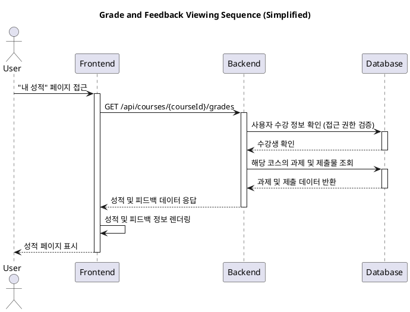

# Use Case: 7. 성적 및 피드백 열람 (Learner) - Simplified

## 1. 개요
- **Goal**: 학습자는 자신이 수강하는 코스의 과제별 성적과 피드백을 확인한다.
- **Reference**: `@docs/goal.md`

## 2. 상세 명세
- **Primary Actor**: Learner (학습자)
- **Precondition**:
  - 코스에 과제를 제출했다.
- **Trigger**: 학습자가 특정 코스의 '성적' 페이지에 접근한다.

## 3. Main Scenario (주요 흐름)
1. 사용자는 특정 코스의 성적 페이지로 이동한다.
2. 시스템은 해당 코스의 모든 과제 목록과 사용자의 제출 정보를 조회한다.
3. 시스템은 각 과제에 대해 다음 정보를 표시한다:
    - 과제명
    - 획득 점수 (예: 85)
    - Instructor의 피드백
    - 제출 상태 (`채점 완료` 또는 `채점 중`)
4. 총점 계산 기능은 최소 기능 원칙에 따라 제외한다.

## 4. Edge Cases (예외 처리)
- **채점되지 않은 과제**: 제출했지만 아직 채점되지 않은 경우, 점수란에 "채점 중"으로 표시한다.
- **제출물 없는 경우**: 제출한 과제가 없으면 "제출한 과제가 없습니다."와 같은 안내 메시지를 표시한다.
- **API 오류**: 데이터 조회 실패 시, "오류가 발생했습니다." 메시지를 표시한다.

## 5. Business Rules (비즈니스 규칙)
- 학습자는 자신의 성적과 피드백만 조회할 수 있다.
- 제출물의 `score` 필드에 값이 있으면 '채점 완료', `null`이면 '채점 중'으로 간주한다.

## 6. Sequence Diagram

