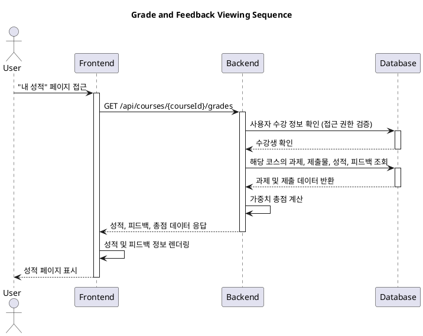

# Use Case: 7. 성적 및 피드백 열람 (Learner)

## 1. 개요
- **Goal**: 학습자는 자신이 수강하는 코스의 과제별 성적, 피드백, 그리고 총점을 확인하여 학습 진행 상황을 파악한다.
- **Reference**: `@docs/goal.md`

## 2. 상세 명세
- **Primary Actor**: Learner (학습자)
- **Precondition**:
  - 코스에 하나 이상의 과제를 제출했다.
  - 제출한 과제 중 하나 이상이 Instructor에 의해 채점되었다.
- **Trigger**: 학습자가 특정 코스의 '성적' 또는 '내 학습 현황' 페이지에 접근한다.

## 3. Main Scenario (주요 흐름)
1. 사용자는 특정 코스의 성적 페이지로 이동한다.
2. 시스템은 해당 코스의 모든 과제 목록과 사용자의 제출물, 성적, 피드백 데이터를 조회한다.
3. 시스템은 각 과제에 대해 다음 정보를 표시한다:
    - 과제명
    - 획득 점수 (예: 85/100)
    - 제출 상태 (`채점 완료`, `제출됨`, `지각`, `재제출 필요`)
    - Instructor의 피드백
4. 시스템은 각 과제의 비중을 반영하여 계산된 코스 총점을 함께 표시한다.

## 4. Edge Cases (예외 처리)
- **채점되지 않은 과제**: 제출했지만 아직 채점되지 않은 경우, 점수란에 "채점 중" 또는 "-"로 표시하고 총점 계산에서 제외한다.
- **제출물 없는 경우**: 제출한 과제가 없으면 "아직 제출한 과제가 없습니다."와 같은 안내 메시지를 표시한다.
- **API 오류**: 백엔드에서 데이터를 가져오는 데 실패하면, 사용자에게 친화적인 오류 메시지를 표시한다.

## 5. Business Rules (비즈니스 규칙)
- 학습자는 자신의 성적과 피드백만 조회할 수 있다.
- 총점은 채점이 완료된 모든 과제의 `(점수 × 비중)`의 합으로 계산된다.
- 채점 대기 중인 과제는 총점 계산에 포함되지 않는다.

## 6. Sequence Diagram

