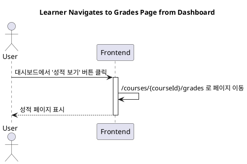

# 상세 구현 설계: 학습자 대시보드에 성적 페이지 이동 버튼 추가

## 1. 개요

학습자가 자신의 대시보드에서 수강 중인 각 코스의 성적 페이지로 쉽게 이동할 수 있도록, 코스 목록에 '성적 보기' 버튼을 추가하는 기능을 설계합니다.

## 2. 관련 기능

- **대시보드 페이지**: `src/app/(protected)/dashboard/page.tsx`
  - 사용자의 역할에 따라 학습자 또는 강사 대시보드를 렌더링하는 진입점입니다.
- **학습자 대시보드 컴포넌트**: `src/features/dashboard/components/LearnerDashboard.tsx`
  - 학습자에게 보여지는 대시보드 UI 컴포넌트입니다. 현재는 목업 데이터로 '수강 가능한 코스'를 표시하고 있으나, 추후 '수강 중인 코스' 목록을 표시하도록 수정되어야 합니다. 이 컴포넌트 내의 각 코스 카드에 버튼이 추가될 것입니다.

## 3. 기능 명세

- **Primary Actor**: Learner (학습자)
- **Precondition**: 
  - 사용자가 학습자 역할로 로그인했습니다.
  - 하나 이상의 코스에 수강 등록한 상태입니다.
- **Trigger**: 사용자가 대시보드 페이지(`/dashboard`)에 접근합니다.

- **Main Scenario**:
  1. 학습자가 대시보드에 접속합니다.
  2. 화면에 '수강 중인 코스' 목록이 나타납니다.
  3. 각 코스 카드(또는 목록 아이템) 내부에 **'성적 보기'** 버튼이 표시됩니다.
  4. 학습자가 특정 코스의 '성적 보기' 버튼을 클릭합니다.
  5. 해당 코스의 성적 페이지(`/courses/{courseId}/grades`)로 이동합니다.

- **Edge Cases**:
  - **코스 ID 누락**: 만약 코스 데이터에 `id`가 없는 경우, 버튼이 렌더링되지 않거나 비활성화 처리하여 잘못된 링크로의 이동을 방지해야 합니다.
  - **페이지 이동 방식**: 사용자의 편의성을 위해, 페이지 전체가 새로고침되는 `<a>` 태그 대신 Next.js의 `<Link>` 컴포넌트를 사용하여 부드러운 클라이언트 사이드 네비게이션을 구현해야 합니다.

- **Business Rules**:
  - '성적 보기' 버튼은 학습자가 현재 수강 중인 코스에 대해서만 표시되어야 합니다.
  - 버튼 클릭 시 이동하는 URL은 반드시 `/courses/{courseId}/grades` 형식을 따라야 합니다.

## 4. Sequence Diagram

대시보드에서 성적 페이지로 이동하는 것은 순수 프론트엔드 내에서 발생하는 네비게이션 이벤트입니다.

